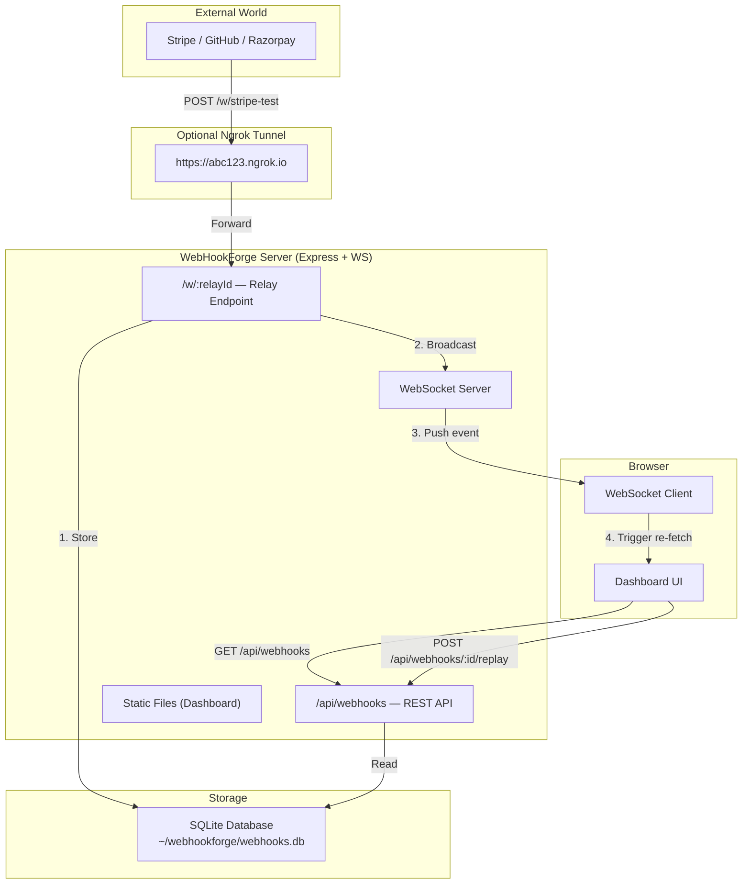
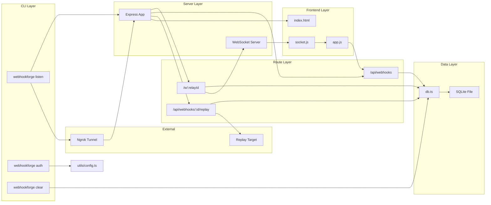

# WebHookForge — Complete End-to-End Walkthrough

> This document explains everything about WebHookForge from the ground up. If you have never seen the codebase before, read this top to bottom and you will understand every moving part.

---

## Table of Contents

- [Part 1: What Problem Does This Solve?](#part-1-what-problem-does-this-solve)
- [Part 2: What Is WebHookForge?](#part-2-what-is-webhookforge)
- [Part 3: Project Architecture — The Big Picture](#part-3-project-architecture--the-big-picture)
- [Part 4: Project File Map — What Every File Does](#part-4-project-file-map--what-every-file-does)
- [Part 5: The Entry Point — How The App Starts](#part-5-the-entry-point--how-the-app-starts)
- [Part 6: The Server Core — server.ts](#part-6-the-server-core--serverts)
- [Part 7: The Relay Endpoint — How Webhooks Are Captured](#part-7-the-relay-endpoint--how-webhooks-are-captured)
- [Part 8: The Database Layer — How Webhooks Are Stored](#part-8-the-database-layer--how-webhooks-are-stored)
- [Part 9: The REST API — How The Dashboard Reads Data](#part-9-the-rest-api--how-the-dashboard-reads-data)
- [Part 10: The WebSocket System — Real-Time Updates](#part-10-the-websocket-system--real-time-updates)
- [Part 11: The Replay System — Re-firing Webhooks](#part-11-the-replay-system--re-firing-webhooks)
- [Part 12: The Frontend Dashboard](#part-12-the-frontend-dashboard)
- [Part 13: The CLI System — Commander.js](#part-13-the-cli-system--commanderjs)
- [Part 14: Ngrok Tunnel — Making Localhost Public](#part-14-ngrok-tunnel--making-localhost-public)
- [Part 15: Error Handling — What Happens When Things Break](#part-15-error-handling--what-happens-when-things-break)
- [Part 16: Security Measures](#part-16-security-measures)
- [Part 17: Complete Data Flow — End to End](#part-17-complete-data-flow--end-to-end)
- [Part 18: Complete Control Flow — Through the Middleware Stack](#part-18-complete-control-flow--through-the-middleware-stack)
- [Part 19: Configuration and Distribution](#part-19-configuration-and-distribution)
- [Part 20: Summary — How Everything Connects](#part-20-summary--how-everything-connects)

---

## Part 1: What Problem Does This Solve?

### What is a webhook?

A webhook is an HTTP request that an external service sends to YOUR server when something happens. For example:

- **Stripe** sends a POST to your server when a payment succeeds
- **GitHub** sends a POST when someone pushes code to a repo
- **Razorpay** sends a POST when a refund is processed

Your server needs to receive these requests, read the payload, and do something with the data.

### Why is this hard during development?

When you are developing locally, your server runs on `localhost:3000`. The problem is that Stripe, GitHub, and Razorpay cannot reach `localhost` — it is not a public address. You have three bad options:

1. **Deploy to a staging server every time** — slow and painful
2. **Use a tunnel like Ngrok** — the webhook arrives, but you have no way to see it, replay it, or debug it easily
3. **Add `console.log` everywhere** — messy, temporary, and you lose the data when the server restarts

### What WebHookForge does

WebHookForge gives you a **local relay server** that:

1. **Catches** every incoming webhook and stores it in a database
2. **Shows** every webhook in a real-time dashboard (updates instantly, no refresh needed)
3. **Replays** any stored webhook to your actual backend whenever you need to test
4. **Optionally tunnels** via Ngrok so external services can actually reach your local machine

All of this installs with a single command: `npm install -g webhookforge`

---

## Part 2: What Is WebHookForge?

WebHookForge is a **CLI tool** written in **TypeScript** that starts a local **Express server** with:

| Component | Technology | Purpose |
|---|---|---|
| HTTP Server | Express.js 5 | Receives webhooks and serves REST API |
| Database | SQLite via Prisma | Stores webhooks persistently |
| Real-time | WebSocket (`ws`) | Pushes live updates to the dashboard |
| Dashboard | Vanilla HTML/JS/CSS | Visual interface for inspecting webhooks |
| CLI | Commander.js | Command-line interface (`listen`, `auth`, `clear`) |
| Tunnel | @ngrok/ngrok SDK | Exposes localhost to the internet |

---

## Part 3: Project Architecture — The Big Picture



### The architecture has five layers:

```
┌─────────────────────────────────────────────────────────┐
│  Layer 1: CLI (cli.ts + Commander.js)                   │
│  → Parses commands, starts the server, manages config   │
├─────────────────────────────────────────────────────────┤
│  Layer 2: HTTP Server (server.ts + Express)             │
│  → Middleware stack, routing, static files               │
├─────────────────────────────────────────────────────────┤
│  Layer 3: Route Handlers (routes/*.ts)                  │
│  → webhook.ts (relay), webhooks.ts (API), replay.ts     │
├─────────────────────────────────────────────────────────┤
│  Layer 4: Data Layer (db.ts + Prisma + SQLite)          │
│  → Insert, query, delete, count operations              │
├─────────────────────────────────────────────────────────┤
│  Layer 5: Real-Time Layer (ws/*.ts)                     │
│  → WebSocket server, broadcast, heartbeat               │
└─────────────────────────────────────────────────────────┘
```

---

## Part 4: Project File Map — What Every File Does

Here is every file in the project and its single-sentence purpose:

### Core Application

| File | Purpose |
|---|---|
| [cli.ts](file:///e:/WebHookForge/cli.ts) | Entry point — defines CLI commands (`listen`, `auth`, `clear`) using Commander.js |
| [server.ts](file:///e:/WebHookForge/server.ts) | Creates the Express app, registers all middleware and routes, attaches WebSocket |
| [db.ts](file:///e:/WebHookForge/db.ts) | Database layer — all SQLite/Prisma operations (insert, read, delete, count) |

### Routes (HTTP Endpoints)

| File | Purpose |
|---|---|
| [routes/webhook.ts](file:///e:/WebHookForge/routes/webhook.ts) | The relay endpoint (`/w/:relayId`) — catches incoming webhooks |
| [routes/webhooks.ts](file:///e:/WebHookForge/routes/webhooks.ts) | REST API for the dashboard (`GET/DELETE /api/webhooks`) |
| [routes/replay.ts](file:///e:/WebHookForge/routes/replay.ts) | Replay endpoint (`POST /api/webhooks/:id/replay`) |

### WebSocket

| File | Purpose |
|---|---|
| [ws/server.ts](file:///e:/WebHookForge/ws/server.ts) | WebSocket server setup — connections, heartbeat, subscribe handling |
| [ws/broadcast.ts](file:///e:/WebHookForge/ws/broadcast.ts) | Broadcast function — pushes events to all connected dashboard clients |

### Utilities

| File | Purpose |
|---|---|
| [utils/config.ts](file:///e:/WebHookForge/utils/config.ts) | Saves and reads the Ngrok auth token from `~/webhookforge.json` |
| [utils/tunnel.ts](file:///e:/WebHookForge/utils/tunnel.ts) | Creates the Ngrok tunnel using the `@ngrok/ngrok` SDK |

### Middleware

| File | Purpose |
|---|---|
| [middleware/error.ts](file:///e:/WebHookForge/middleware/error.ts) | 404 handler and global error handler |

### Frontend (Dashboard)

| File | Purpose |
|---|---|
| [public/index.html](file:///e:/WebHookForge/public/index.html) | Dashboard HTML — layout, styles, structure |
| [public/app.js](file:///e:/WebHookForge/public/app.js) | Dashboard logic — fetch webhooks, render list, pagination, delete, replay |
| [public/socket.js](file:///e:/WebHookForge/public/socket.js) | WebSocket client — connects to server, handles live events, auto-reconnects |

### Configuration

| File | Purpose |
|---|---|
| [package.json](file:///e:/WebHookForge/package.json) | Dependencies, scripts, CLI binary definition, npm metadata |
| [tsconfig.json](file:///e:/WebHookForge/tsconfig.json) | TypeScript compiler settings (ES2022 target, strict mode, ESM modules) |
| [prisma/schema.prisma](file:///e:/WebHookForge/prisma/schema.prisma) | Database schema — defines the Webhook table structure |
| [.gitignore](file:///e:/WebHookForge/.gitignore) | Files excluded from Git (node_modules, dist, .env, *.db) |

---

## Part 5: The Entry Point — How The App Starts

Everything begins in [cli.ts](file:///e:/WebHookForge/cli.ts). When a user runs `webhookforge listen`, here is exactly what happens:

### Step 1: Commander parses the command

```typescript
// cli.ts — lines 22-25
const program = new Command();
program
    .name('webhookforge')
    .description('A local developer CLI tool for testing and replaying webhooks')
    .version(version);
```

Commander.js reads `process.argv` (the command-line arguments) and matches the `listen` subcommand.

### Step 2: The `listen` command starts the HTTP server

```typescript
// cli.ts — lines 27-62
program
    .command('listen')
    .option('-p, --port <number>', 'port to bind on', '3000')
    .action((options) => {
        const port = parseInt(options.port, 10);
        server.listen(port, async () => {
            // Print the banner with dashboard URL
            // Create the Ngrok tunnel
            const publicUrl = await createTunnel(port);
            // Print the public relay URL
        });
    })
```

The `server` object imported from `server.ts` is an `http.Server` — calling `.listen(port)` opens port 3000 and starts accepting connections.

### Step 3: The Ngrok tunnel is created (optional)

After the server starts, `createTunnel(port)` is called. If the user has saved an Ngrok auth token, a public URL is created. If not, the tool prints instructions and continues in local-only mode.

### The other CLI commands

| Command | What it does |
|---|---|
| `webhookforge listen` | Starts the server + tunnel |
| `webhookforge auth <token>` | Saves Ngrok auth token to `~/webhookforge.json` |
| `webhookforge clear` | Deletes all webhooks from the database |

---

## Part 6: The Server Core — server.ts

[server.ts](file:///e:/WebHookForge/server.ts) is the heart of the application. It creates the Express app, registers all middleware in a specific order, and exports the HTTP server.

### The middleware stack (ORDER MATTERS)

Express processes middleware in the exact order it is registered. Here is the order and why:

```
Request arrives
    │
    ▼
┌─── 1. express.json({ limit: '1mb', verify: ... }) ───┐
│    Parses JSON body AND captures raw body buffer       │
│    The verify callback runs BEFORE parsing              │
└────────────────────────────────────────────────────────┘
    │
    ▼
┌─── 2. express.urlencoded({ limit: '1mb', verify: ... }) ───┐
│    Same as above, but for form-encoded bodies                │
└──────────────────────────────────────────────────────────────┘
    │
    ▼
┌─── 3. Favicon handler ───────────────────────────────┐
│    Returns 204 for /favicon.ico (stops browsers       │
│    from generating noise in logs)                     │
└───────────────────────────────────────────────────────┘
    │
    ▼
┌─── 4. Request logger ────────────────────────────────┐
│    Logs method, URL, status code, and duration        │
│    SKIPS dashboard traffic and internal API calls     │
│    Only logs actual webhook traffic                   │
└───────────────────────────────────────────────────────┘
    │
    ▼
┌─── 5. express.static('public') ──────────────────────┐
│    Serves index.html, app.js, socket.js               │
└───────────────────────────────────────────────────────┘
    │
    ▼
┌─── 6. Route handlers ───────────────────────────────┐
│    /w/:relayId  → webhook.ts (relay endpoint)        │
│    /api/*       → webhooks.ts + replay.ts (REST API) │
│    /health      → health check                       │
└──────────────────────────────────────────────────────┘
    │
    ▼
┌─── 7. notFoundHandler ───────────────────────────────┐
│    Any request that matched NO route → 404 JSON       │
└───────────────────────────────────────────────────────┘
    │
    ▼
┌─── 8. errorHandler ─────────────────────────────────┐
│    Any error thrown/passed via next(err) → 500 JSON   │
│    Shows stack trace only in development mode         │
└──────────────────────────────────────────────────────┘
```

### The raw body preservation trick

This is the most important middleware detail in the entire project:

```typescript
// server.ts — lines 22-27
app.use(express.json({
    limit: '1mb',
    verify: (req: Request, res: Response, buf: Buffer) => {
        (req as RawBodyRequest).rawBody = buf.toString('utf8');
    }
}));
```

**Why this exists:** When Stripe sends a webhook, it also sends a signature header (`Stripe-Signature`). To verify that signature, you need the **exact original bytes** of the request body. But `express.json()` parses those bytes into a JavaScript object — the original formatting, whitespace, and key order are lost. The `verify` callback runs **before** the parse happens, giving us the raw `Buffer`. We convert it to a string and save it as `req.rawBody`.

Now the request carries BOTH:
- `req.body` — the parsed JavaScript object (convenient for reading)
- `req.rawBody` — the original string (needed for HMAC signature verification)

### The HTTP server and WebSocket sharing

```typescript
// server.ts — line 19
const server = http.createServer(app);
```

Instead of letting Express create its own HTTP server (which is what `app.listen()` does internally), we create the HTTP server manually. This lets us attach the WebSocket server to the **same server on the same port**. The browser connects to `ws://localhost:3000` for WebSocket and `http://localhost:3000` for HTTP — same port, same server.

---

## Part 7: The Relay Endpoint — How Webhooks Are Captured

[routes/webhook.ts](file:///e:/WebHookForge/routes/webhook.ts) is the endpoint that catches incoming webhooks. This is the core feature.

### The route definition

```typescript
// routes/webhook.ts — line 9
router.all('/w/:relayId', async (req, res, next) => { ... });
```

> [!IMPORTANT]
> It uses `router.all()`, not `router.post()`. This accepts **any HTTP method** — POST, PUT, PATCH, DELETE, GET. Different webhook providers use different methods, and we want to capture all of them.

### The URL structure: `/w/:relayId`

The `:relayId` is a dynamic parameter. The user chooses any string as their relay ID:

- `/w/stripe-payments` — relay ID is `stripe-payments`
- `/w/github-pushes` — relay ID is `github-pushes`
- `/w/test` — relay ID is `test`

This lets you have multiple relay endpoints for different integrations, all on the same server.

### What happens when a webhook arrives

```typescript
// routes/webhook.ts — lines 10-28
const { relayId } = req.params;                     // 1. Extract relay ID from URL

const rawIp = req.headers['x-forwarded-for']        // 2. Get client's real IP
    || req.ip || req.socket?.remoteAddress;          //    (x-forwarded-for for proxied requests)
const trueIp = Array.isArray(rawIp) ? rawIp[0]      //    (take first IP if it's a list)
    : rawIp;

const webhook: db.WebhookInput = {                  // 3. Build the webhook object
    id: uuidv4(),                                    //    Generate a unique UUID
    relay_id: relayId,                               //    From the URL
    method: req.method,                              //    POST, PUT, GET, etc.
    headers: req.headers,                            //    All HTTP headers
    body: req.body,                                  //    Parsed JSON body
    rawBody: rawReq.rawBody || ...,                  //    Raw body string (for HMAC)
    query: req.query,                                //    URL query parameters
    source_ip: trueIp,                               //    Client's IP address
    timestamp: new Date().toISOString(),              //    When it arrived
    status: "received"                               //    Initial status
};

await db.insert(webhook);                            // 4. Store in SQLite
broadcast('new_webhook', webhook);                   // 5. Push to all dashboard clients
res.status(200).json({                               // 6. Respond to the sender
    success: true,
    id: webhook.id,
    message: `Webhook received on relay ${relayId}`
});
```

### The three things that happen in sequence:

1. **Store** → The webhook is persisted in SQLite so it survives server restarts
2. **Broadcast** → The webhook is pushed to all connected WebSocket clients instantly
3. **Respond** → The sender (Stripe, GitHub, etc.) gets a 200 OK confirmation

---

## Part 8: The Database Layer — How Webhooks Are Stored

[db.ts](file:///e:/WebHookForge/db.ts) is the data access layer. It sits between the route handlers and SQLite/Prisma.

### Database location

```typescript
// db.ts — lines 7-8
const dbFolder = path.join(os.homedir(), 'webhookforge');
const dbPath = path.join(dbFolder, 'webhooks.db');
```

The database lives at `~/webhookforge/webhooks.db` — inside the user's home directory. This means:
- On macOS: `/Users/yourname/webhookforge/webhooks.db`
- On Windows: `C:\Users\yourname\webhookforge\webhooks.db`
- On Linux: `/home/yourname/webhookforge/webhooks.db`

The directory is created automatically if it does not exist:

```typescript
// db.ts — lines 11-13
if (!fs.existsSync(dbFolder)) {
    fs.mkdirSync(dbFolder, { recursive: true })
}
```

### The Prisma schema (the source of truth for the database structure)

```prisma
// prisma/schema.prisma
model Webhook {
  id        String    @id                    // UUID primary key
  relayId   String    @map("relay_id")       // Which relay endpoint received it
  method    String    @default("POST")       // HTTP method
  headers   String                           // JSON string of all headers
  body      String?                          // JSON string of body (nullable)
  rawBody   String?                          // Original raw body string
  query     String?                          // JSON string of query params
  sourceIp  String?   @map("source_ip")      // Client's IP address
  timestamp DateTime  @default(now())        // When it was received
  status    String    @default("received")   // "received", "replayed", "failed"

  @@index([relayId])                         // Index for filtering by relay
  @@index([timestamp(sort: Desc)])           // Index for sorting by newest first
  @@map("webhooks")                          // Table name in SQLite
}
```

> [!NOTE]
> `headers`, `body`, and `query` are stored as **JSON strings** in TEXT columns — not native JSON. This is because SQLite does not have a native JSON column type. The `db.ts` file handles serialisation (object → string when writing) and deserialisation (string → object when reading).

### The data operations

| Function | What it does | Used by |
|---|---|---|
| `insert(webhook)` | Stores a new webhook | Relay endpoint |
| `getAll(limit, offset)` | Gets paginated list of all webhooks | Dashboard API |
| `getById(id)` | Gets a single webhook by UUID | Detail view & replay |
| `getByRelayId(relayId, limit, offset)` | Gets webhooks filtered by relay ID | Filtered dashboard view |
| `deleteById(id)` | Deletes one webhook | Dashboard delete button |
| `deleteAll()` | Deletes all webhooks | Dashboard "Clear Database" & CLI `clear` |
| `count()` | Total number of webhooks | Pagination metadata |
| `countByRelayId(relayId)` | Count for a specific relay | Filtered pagination |
| `updateStatus(id, status)` | Updates status to "replayed" or "failed" | Replay endpoint |

### JSON serialisation/deserialisation

When **writing** to the database:
```typescript
// db.ts — line 64
headers: JSON.stringify(webhook.headers),  // Object → String
body: webhook.body ? JSON.stringify(webhook.body) : undefined,
```

When **reading** from the database:
```typescript
// db.ts — lines 45-54
function formatWebhookData(webhook: any) {
    return {
        ...webhook,
        headers: webhook.headers ? JSON.parse(webhook.headers) : {},  // String → Object
        body: webhook.body ? JSON.parse(webhook.body) : null,
        query: webhook.query ? JSON.parse(webhook.query) : null,
    };
}
```

### The safety net: runtime schema creation

Even though the schema is defined in Prisma, the code also creates the table at startup using raw SQL:

```typescript
// db.ts — lines 160-178
await prisma.$executeRawUnsafe(`
    CREATE TABLE IF NOT EXISTS "webhooks" ( ... );
`);
await prisma.$executeRawUnsafe(`
    CREATE INDEX IF NOT EXISTS "webhooks_relay_id_idx" ON "webhooks"("relay_id");
`);
await prisma.$executeRawUnsafe(`
    CREATE INDEX IF NOT EXISTS "webhooks_timestamp_idx" ON "webhooks"("timestamp" DESC);
`);
```

**Why both?** Prisma's schema is the documentation and type-generation source. The runtime `CREATE TABLE IF NOT EXISTS` is a safety net that ensures the table exists even if Prisma migrations were never run. For a CLI tool that must "just work" on first install, this belt-and-suspenders approach is important.

### The P2025 pattern — handling "not found" in delete/update

```typescript
// db.ts — lines 106-117
export async function deleteById(id: string): Promise<DbResult> {
    try {
        await prisma.webhook.delete({ where: { id } });
        return { changes: 1 };
    } catch (err) {
        if (err instanceof Prisma.PrismaClientKnownRequestError 
            && err.code === 'P2025') {   // ← "Record to delete does not exist"
            return { changes: 0 };        // ← Return 0 changes instead of crashing
        }
        throw err;  // ← Re-throw unexpected errors
    }
}
```

Prisma throws a `P2025` error when you try to delete a record that does not exist. Instead of letting this crash the server, we catch it and return `{ changes: 0 }`. The route handler then checks this value and returns a 404 to the client. This cleanly separates database concerns from HTTP concerns.

---

## Part 9: The REST API — How The Dashboard Reads Data

[routes/webhooks.ts](file:///e:/WebHookForge/routes/webhooks.ts) provides the REST API that the dashboard uses to fetch, display, and manage webhooks.

### Endpoints overview

| Method | Path | Purpose |
|---|---|---|
| GET | `/api/webhooks` | List webhooks (paginated) |
| GET | `/api/webhooks/:id` | Get one webhook's full details |
| DELETE | `/api/webhooks/:id` | Delete one webhook |
| DELETE | `/api/webhooks` | Delete all webhooks |

### Pagination — how it works

```typescript
// routes/webhooks.ts — lines 10-11
const page = Math.max(1, parseInt(req.query.page as string, 10) || 1);
const limit = Math.min(100, Math.max(1, parseInt(req.query.limit as string, 10) || 20));
```

- `page` defaults to 1, minimum 1
- `limit` defaults to 20, clamped between 1 and 100 (prevents someone requesting 1 million records)
- `offset` is calculated as `(page - 1) * limit`

The response includes full pagination metadata:

```json
{
  "data": [ ... ],
  "pagination": {
    "page": 1,
    "limit": 20,
    "total": 47,
    "totalPages": 3,
    "hasNext": true,
    "hasPrev": false
  }
}
```

### Parallel queries with Promise.all

```typescript
// routes/webhooks.ts — lines 21-24
[webhooks, total] = await Promise.all([
    db.getByRelayId(relayId, limit, offset),
    db.countByRelayId(relayId)
]);
```

The list query and the count query are **independent** — neither needs the other's result. `Promise.all` runs them in parallel, cutting the response time in half compared to running them sequentially.

---

## Part 10: The WebSocket System — Real-Time Updates

The WebSocket system has two files that work together:

### [ws/server.ts](file:///e:/WebHookForge/ws/server.ts) — Server setup and connection management

**Key concepts:**

1. **The `clients` Set** — A `Set<WebSocket>` that tracks every connected browser tab
2. **The `ExtWebSocket` interface** — Extends the basic WebSocket with `isAlive` (for heartbeats) and `subscribedRelayId` (for filtering)
3. **The heartbeat** — A 30-second interval that detects dead connections

**Connection lifecycle:**

```
Browser opens WebSocket → 'connection' event fires
    │
    ├── Add to clients Set
    ├── Set isAlive = true
    ├── Send welcome message
    │
    ├── On 'message': Parse JSON, handle 'subscribe' type
    ├── On 'pong': Set isAlive = true (heartbeat response)
    ├── On 'close': Remove from clients Set
    └── On 'error': Log error, remove from clients Set
```

**The heartbeat mechanism explained:**

```typescript
// ws/server.ts — lines 83-94
const interval = setInterval(() => {
    wss.clients.forEach((client) => {
        const extWs = client as ExtWebSocket;
        if (extWs.isAlive === false) {      // Didn't respond to last ping
            clients.delete(extWs);
            return extWs.terminate();        // Kill the zombie connection
        }
        extWs.isAlive = false;              // Reset the flag
        extWs.ping();                        // Send a ping
    });
}, 30000);                                   // Every 30 seconds
```

The cycle is:
1. Set `isAlive = false` for every client
2. Send a `ping` frame to every client
3. Alive clients respond with `pong`, which sets `isAlive = true`
4. On the NEXT cycle (30 seconds later), any client still `false` is dead → terminate it

**Why this is necessary:** If a browser tab crashes, the user closes their laptop, or the network drops, the TCP connection may not close cleanly. Without heartbeats, these "zombie" connections would stay in the `clients` Set forever, wasting memory and causing failed send attempts on every broadcast.

### [ws/broadcast.ts](file:///e:/WebHookForge/ws/broadcast.ts) — Pushing events to clients

```typescript
// ws/broadcast.ts — lines 5-41
export function broadcast(type: string, payload: unknown, targetRelayId?: string): void {
    const message = JSON.stringify({ type, payload, timestamp: new Date().toISOString() });

    for (const client of clients) {
        const extClient = client as ExtWebSocket;
        const isOpen = extClient.readyState === WebSocket.OPEN;
        const isTargeted = !targetRelayId || extClient.subscribedRelayId === targetRelayId;
        
        if (isOpen && isTargeted) {
            try {
                extClient.send(message);
            } catch (err) {
                clients.delete(client);  // Remove dead client on send failure
            }
        }
    }
}
```

**Key design decisions:**

1. **JSON is serialised ONCE** outside the loop — if there are 100 clients, we do not call `JSON.stringify` 100 times
2. **Filtering by relay ID** — if a client subscribed to a specific relay, it only gets events for that relay
3. **Try-catch per client** — if sending to one client fails, the broadcast continues to the others. The failed client is removed from the Set.

---

## Part 11: The Replay System — Re-firing Webhooks

[routes/replay.ts](file:///e:/WebHookForge/routes/replay.ts) lets you take a stored webhook and send it to any URL. This is the "time travel debugging" feature.

### How replay works step by step

```
1. Dashboard user clicks "Replay" on a webhook
2. Browser prompts for a target URL (e.g., http://localhost:4000/my-handler)
3. Browser POSTs to /api/webhooks/:id/replay with { target_url: "..." }
4. Server fetches the stored webhook from the database
5. Server rebuilds the original HTTP request (method, headers, body)
6. Server sends it to the target URL using fetch()
7. Server records the target's response
8. Server updates the webhook's status to "replayed" or "failed"
9. Dashboard shows the result
```

### Header forwarding — what gets removed and why

```typescript
// routes/replay.ts — lines 43-46
const forwardHeaders = { ...originalHeaders };
delete forwardHeaders['host'];            // Would point to the relay server, not the target
delete forwardHeaders['content-length'];  // Body may be re-serialised with different size
delete forwardHeaders['connection'];      // Hop-by-hop header, must not be forwarded
```

### Custom replay headers

```typescript
// routes/replay.ts — lines 55-56
'X-WebhookForge-Replay': 'true',         // Tells the target this is a replay
'X-WebhookForge-Original-Id': webhook.id, // Links back to the original webhook
```

These headers let the receiving server know it is getting a replay, not a fresh webhook. This is important for **idempotency** — the server can check for this header and skip duplicate processing.

### Error handling in replay

| Scenario | What happens |
|---|---|
| Target URL is missing | 400 Bad Request — immediate validation |
| Target URL is malformed | 400 Bad Request — `new URL()` throws |
| Target returns any HTTP response | Status recorded, webhook marked "replayed" |
| Target is unreachable (network error) | 502 Bad Gateway, webhook marked "failed" |
| Response body is huge | Truncated to 1000 characters with `.substring(0, 1000)` |

---

## Part 12: The Frontend Dashboard

The dashboard is built with **vanilla HTML, CSS, and JavaScript** — no frameworks. It consists of three files served as static assets.

### [public/index.html](file:///e:/WebHookForge/public/index.html) — Structure and styling

The HTML defines:
- A **header** with the WebHookForge logo and a connection status indicator (green dot = live)
- A **stats bar** showing total webhook count, current page, and a "Clear Database" button
- A **webhook list** container that gets populated by JavaScript
- A **pagination** container

The CSS uses **CSS custom properties** (variables) for a consistent dark theme:

```css
:root {
    --bg-primary: #110f0c;        /* Dark background */
    --bg-card: #1f1b14;           /* Card background */
    --accent: #e8a842;            /* Gold accent color */
    --success: #4ade80;           /* Green for "received" status */
    --danger: #ef4444;            /* Red for "failed" status */
    --font-mono: 'JetBrains Mono';/* Monospace for code/IDs */
    --font-sans: 'Inter';         /* Sans-serif for text */
}
```

### [public/app.js](file:///e:/WebHookForge/public/app.js) — Dashboard logic

This file handles all dashboard interactions:

**Data fetching:**
```javascript
// app.js — lines 27-43
async function fetchWebhooks(page = 1) {
    const response = await fetch(`/api/webhooks?page=${page}&limit=${limit}`);
    const data = await response.json();
    renderWebhooks(data.data);
    renderPagination(data.pagination);
    // Update stats
}
```

**Webhook card rendering:**
Each webhook is rendered as a clickable card showing the HTTP method, relay ID, status, UUID, and relative time ("3s ago", "5m ago"). Clicking a card loads the full details (headers, body, query params) via a separate API call.

**XSS prevention:**
```javascript
// app.js — lines 14-23
function escapeHTML(str) {
    if (str === null || str === undefined) return '';
    return String(str).replace(/[&<>'"]/g, tag => ({
        '&': '&amp;', '<': '&lt;', '>': '&gt;',
        "'": '&#39;', '"': '&quot;'
    }[tag]));
}
```

Every piece of dynamic content (webhook IDs, headers, bodies) goes through `escapeHTML()` before being inserted into the DOM. Without this, a webhook containing `<script>alert('xss')</script>` in its body would execute JavaScript in the dashboard.

**Lazy loading of details:**
```javascript
// app.js — lines 59-60
if (!detailEl.dataset.loaded) {
    // Fetch full details from /api/webhooks/:id only when first expanded
```

Webhook details (full headers, body, query) are only fetched when the user clicks to expand a card. This avoids loading the full body of every webhook in the list, which would be expensive for large payloads.

**Button state management:**
Every button (Delete, Replay, Clear) disables itself and shows loading text while the operation is in progress, preventing double-clicks:

```javascript
// app.js — lines 113-116
const btn = event.target;
const originalText = btn.innerHTML;
btn.disabled = true;
btn.innerHTML = 'Deleting!';
```

### [public/socket.js](file:///e:/WebHookForge/public/socket.js) — Real-time WebSocket client

**Auto-detection of protocol:**
```javascript
// socket.js — line 1
const protocol = window.location.protocol === 'https:' ? 'wss:' : 'ws:';
```

If the dashboard is served over HTTPS (through Ngrok), the WebSocket uses `wss:` (secure). Otherwise, `ws:`.

**What happens on a new webhook event:**
```javascript
// socket.js — lines 22-28
if (message.type === 'new_webhook') {
    if (typeof fetchWebhooks === 'function') {
        fetchWebhooks(currentPage);  // Re-fetch the current page from the API
    }
}
```

Instead of manually inserting the new webhook into the DOM (which would break pagination counts), the client simply re-fetches the current page. This keeps the UI perfectly in sync with the database.

**Exponential backoff reconnection:**
```javascript
// socket.js — lines 43-46
const delay = Math.min(1000 * Math.pow(2, reconnectAttempts), MAX_RECONNECT_DELAY);
// Delays: 1s, 2s, 4s, 8s, 16s, 30s, 30s, 30s, ...
```

If the WebSocket disconnects, the client automatically reconnects with increasing delays. This prevents hammering the server when it is down. The maximum delay is 30 seconds.

---

## Part 13: The CLI System — Commander.js

[cli.ts](file:///e:/WebHookForge/cli.ts) uses Commander.js to define three commands:

### `webhookforge listen`

- Starts the Express + WebSocket server
- Creates the Ngrok tunnel
- Prints a formatted banner with URLs
- Default port: 3000, customisable with `--port`

### `webhookforge auth <token>`

- Saves the Ngrok auth token to `~/webhookforge.json`
- One-time setup — the token persists across sessions

### `webhookforge clear`

- Deletes ALL webhooks from the database using `prisma.webhook.deleteMany({})`
- Prints the count of deleted records
- Disconnects from Prisma and exits cleanly

### How the CLI binary works

In [package.json](file:///e:/WebHookForge/package.json):

```json
"bin": {
    "webhookforge": "./dist/cli.js"
}
```

When `npm install -g webhookforge` runs, npm creates a system-wide symlink from `webhookforge` to `./dist/cli.js`. The shebang line at the top of `cli.ts`:

```typescript
#!/usr/bin/env node
```

tells the OS to run this file with Node.js.

### Version reading

```typescript
// cli.ts — lines 17-18
const packageJson = JSON.parse(fs.readFileSync(path.join(__dirname, '../package.json'), 'utf-8'));
const version = packageJson.version;
```

The version is read from `package.json` at runtime — there is a single source of truth for the version number. Commander.js then uses this for `webhookforge --version`.

---

## Part 14: Ngrok Tunnel — Making Localhost Public

[utils/tunnel.ts](file:///e:/WebHookForge/utils/tunnel.ts) handles the optional Ngrok integration.

### Token resolution order

```typescript
// utils/tunnel.ts — line 8
const authToken = getToken() || process.env.NGROK_AUTHTOKEN;
```

1. First checks `~/webhookforge.json` (the config file)
2. Falls back to the `NGROK_AUTHTOKEN` environment variable
3. If neither exists, prints instructions and returns `null`

This mirrors the pattern used by AWS CLI (`~/.aws/credentials` → env vars).

### Tunnel creation

```typescript
// utils/tunnel.ts — lines 18-21
const listener = await ngrok.forward({
    addr: port,
    authtoken: authToken,
});
const publicUrl = listener.url();
```

`ngrok.forward()` creates a tunnel that forwards all traffic from a public URL (like `https://abc123.ngrok.io`) to `localhost:port`. The returned `listener` object contains the public URL.

### Graceful shutdown

```typescript
// utils/tunnel.ts — lines 26-30
process.on('SIGINT', async () => {
    console.log('\n Closing Ngrok tunnel safely...');
    await ngrok.disconnect();
    process.exit(0);
});
```

When the user presses Ctrl+C, the tunnel is closed cleanly before the process exits. This prevents orphaned Ngrok sessions.

### Config file storage

[utils/config.ts](file:///e:/WebHookForge/utils/config.ts) provides two functions:

```typescript
// utils/config.ts
const CONFIG_FILE = path.join(os.homedir(), 'webhookforge.json');

export function saveToken(token: string) {
    fs.writeFileSync(CONFIG_FILE, JSON.stringify({ ngrokToken: token }, null, 2));
}

export function getToken(): string | null {
    if (fs.existsSync(CONFIG_FILE)) {
        const config = JSON.parse(fs.readFileSync(CONFIG_FILE, 'utf-8'));
        return config.ngrokToken || null;
    }
    return null;
}
```

The config is a simple JSON file at `~/webhookforge.json` containing `{ "ngrokToken": "..." }`.

---

## Part 15: Error Handling — What Happens When Things Break

[middleware/error.ts](file:///e:/WebHookForge/middleware/error.ts) defines two Express middleware functions:

### 404 — Route not found

```typescript
export function notFoundHandler(req, res, next): void {
    res.status(404).json({
        error: "Not Found",
        message: `The route ${req.method} ${req.originalUrl} does not exist`,
        hint: "Check the URL and HTTP method. Available endpoints: ..."
    });
}
```

This catches any request that matched **no route at all**. It returns a helpful JSON response with available endpoints.

### 500 — Unexpected server error

```typescript
export function errorHandler(err, req, res, next): void {
    const statusCode = err.statusCode || err.status || 500;
    res.status(statusCode).json({
        error: err.name || "Internal Server Error",
        message: err.message || "Something went wrong",
        ...(process.env.NODE_ENV === "development" ? { stack: err.stack } : {})
    });
}
```

**Key detail:** The stack trace is only included when `NODE_ENV=development`. In production, users see the error message but not the internal stack trace (which could leak file paths and code structure).

### How errors flow through the app

In route handlers, errors are passed to Express via `next(err)`:

```typescript
// routes/webhook.ts — lines 40-42
} catch (err) {
    next(err)   // → Express forwards this to errorHandler
}
```

Express 5 (which this project uses) automatically wraps async route handlers — if a Promise rejects, it is treated as if `next(err)` was called. This means unhandled async errors are caught automatically.

---

## Part 16: Security Measures

### 1. Body size limiting (anti-memory-exhaustion)

```typescript
app.use(express.json({ limit: '1mb' }));          // HTTP bodies ≤ 1MB
const wss = new WebSocketServer({ maxPayload: 64 * 1024 }); // WS messages ≤ 64KB
```

### 2. XSS prevention in the dashboard

Every dynamic value is passed through `escapeHTML()` before rendering:

```javascript
// Converts < to &lt;, > to &gt;, etc.
// A webhook body containing <script>alert('xss')</script>
// renders as text, not as executable HTML
```

### 3. Replay response truncation

```typescript
// routes/replay.ts — line 81
response: responseBody.substring(0, 1000)  // Prevents massive payloads from crashing the UI
```

### 4. WebSocket heartbeat (dead connection cleanup)

Zombie connections are detected and terminated every 30 seconds, preventing unbounded memory growth.

### 5. Favicon handling

```typescript
app.get('/favicon.ico', (req, res) => { res.status(204).end() });
```

Returns an empty 204 response for browser favicon requests, preventing them from being logged as webhook traffic or matched as unknown routes.

---

## Part 17: Complete Data Flow — End to End

Here is the complete journey of a webhook from the moment an external service sends it to the moment it appears on the dashboard:

```
Stripe sends POST https://abc123.ngrok.io/w/stripe-payments
    │
    ▼
Ngrok tunnel forwards to localhost:3000/w/stripe-payments
    │
    ▼
Express receives the request
    │
    ▼
Middleware 1: express.json() parses body
    │  → verify callback captures rawBody = buf.toString('utf8')
    │  → Body exceeds 1MB? → 413 Payload Too Large → STOP
    ▼
Middleware 2: Request logger
    │  → Path starts with /w/, so it IS logged
    │  → Records start time, listens for 'finish' event
    ▼
Route match: router.all('/w/:relayId')
    │
    ▼
Handler extracts:
    ├── relayId = "stripe-payments" (from URL params)
    ├── method = "POST" (from req.method)
    ├── headers = { ... } (from req.headers)
    ├── body = { type: "payment.success", ... } (from req.body)
    ├── rawBody = '{"type":"payment.success",...}' (from req.rawBody)
    ├── source_ip = "52.31.42.1" (from x-forwarded-for)
    ├── id = "f47ac10b-..." (generated UUID v4)
    └── timestamp = "2026-06-03T12:15:31.000Z"
    │
    ▼
db.insert() → Prisma → prisma.webhook.create()
    │  → headers/body/query are JSON.stringify'd
    │  → Written to ~/webhookforge/webhooks.db
    ▼
broadcast('new_webhook', webhook)
    │  → JSON.stringify the message ONCE
    │  → Loop through clients Set
    │  → For each client: check readyState === OPEN
    │  → Send JSON message
    ▼
res.status(200).json({ success: true, id: "f47ac10b-..." })
    │  → Stripe receives the 200 and considers the webhook delivered
    ▼
Meanwhile, in the browser...
    │
    ▼
socket.js receives WebSocket message: { type: "new_webhook", payload: {...} }
    │  → message.type === 'new_webhook'
    │  → Calls fetchWebhooks(currentPage)
    ▼
fetchWebhooks() → GET /api/webhooks?page=1&limit=20
    │
    ▼
routes/webhooks.ts handles the GET
    │  → Promise.all([db.getAll(20, 0), db.count()])
    │  → Returns { data: [...], pagination: { total: 48, ... } }
    ▼
renderWebhooks() builds HTML cards
    │  → escapeHTML() on every dynamic value
    │  → Each card shows: method, relay ID, status, time, UUID
    ▼
Dashboard displays the new webhook at the top of the list ✓
```

---

## Part 18: Complete Control Flow — Through the Middleware Stack

This shows how Express processes a request through the middleware chain for different types of requests:

### Scenario 1: Webhook arriving at `/w/test`

```
express.json() → express.urlencoded() → favicon? NO
→ logger: is it dashboard/API traffic? NO → LOG IT
→ express.static: does /w/test match a file in public/? NO
→ Route: /w/:relayId matches! → webhook.ts handler runs
→ SUCCESS → response sent
→ Logger's 'finish' callback fires → prints log line
```

### Scenario 2: Browser loading the dashboard at `/`

```
express.json() → express.urlencoded() → favicon? NO
→ logger: is it dashboard traffic? YES (path === '/') → SKIP logging
→ express.static: does / match index.html? YES → serve index.html
→ DONE (routes are never reached)
```

### Scenario 3: Dashboard calling `GET /api/webhooks`

```
express.json() → express.urlencoded() → favicon? NO
→ logger: starts with /api/? YES → SKIP logging
→ express.static: does /api/webhooks match a file? NO
→ Route: /api/webhooks matches! → webhooks.ts handler runs
→ SUCCESS → response sent
```

### Scenario 4: Unknown route `POST /nonexistent`

```
express.json() → express.urlencoded() → favicon? NO
→ logger: not dashboard, not API → LOG IT
→ express.static: no match
→ Routes: no match in webhook.ts, webhooks.ts, or replay.ts
→ Health check? NO
→ notFoundHandler → 404 JSON response
→ Logger's 'finish' callback fires → prints log line
```

### Scenario 5: Route handler throws an error

```
... → Route matches → handler runs → throw new Error("DB connection failed")
→ Express catches the error (Express 5 async support)
→ Forwards to errorHandler (4-argument middleware)
→ 500 JSON response with error message
→ Stack trace included only if NODE_ENV === "development"
```

---

## Part 19: Configuration and Distribution

### TypeScript Configuration — [tsconfig.json](file:///e:/WebHookForge/tsconfig.json)

| Setting | Value | Why |
|---|---|---|
| `target` | ES2022 | Modern JavaScript features (top-level await, private fields) |
| `module` | nodenext | Native ESM module system (import/export) |
| `moduleResolution` | nodenext | Requires `.js` extensions in imports (Node.js ESM convention) |
| `strict` | true | All strict type-checking flags enabled |
| `outDir` | ./dist | Compiled JS goes to dist/ |
| `declaration` | true | Generates `.d.ts` type declaration files |

### npm Configuration — [package.json](file:///e:/WebHookForge/package.json)

| Field | Value | Why |
|---|---|---|
| `type` | "module" | Enables ESM (import/export instead of require) |
| `main` | "dist/server.js" | Library entry point if someone imports the package |
| `bin.webhookforge` | "./dist/cli.js" | CLI binary entry point |
| `scripts.postinstall` | "npx prisma generate" | Auto-generates Prisma client on install |
| `files` | ["dist", "public", "prisma"] | Only these folders are included in the npm package |

### Dependencies explained

| Package | Version | Why it exists |
|---|---|---|
| `express` | ^5.2.1 | HTTP server with routing and middleware |
| `@prisma/client` | ^6.19.3 | Database ORM for SQLite |
| `prisma` | ^6.19.3 | Prisma CLI for schema management |
| `ws` | ^8.21.0 | WebSocket server implementation |
| `commander` | ^14.0.3 | CLI framework for command parsing |
| `uuid` | ^14.0.0 | UUID v4 generation for webhook IDs |
| `@ngrok/ngrok` | ^1.7.0 | Ngrok SDK for tunnel creation |

### Dev dependencies

| Package | Purpose |
|---|---|
| `typescript` | TypeScript compiler |
| `tsx` | TypeScript execution for development (`npm run dev`) |
| `@types/express` | Type definitions for Express |
| `@types/ws` | Type definitions for ws |
| `@types/node` | Type definitions for Node.js |

---

## Part 20: Summary — How Everything Connects



### The five connections that make it all work:

1. **External service → Relay endpoint**: Webhook arrives, gets stored and broadcast
2. **Relay endpoint → WebSocket server**: `broadcast()` pushes the event to all connected clients
3. **WebSocket client → Dashboard**: `fetchWebhooks()` is triggered, re-fetching the current page
4. **Dashboard → REST API**: All data display goes through the paginated `/api/webhooks` endpoint
5. **Dashboard → Replay endpoint → Target**: User clicks Replay, webhook is re-sent to their local server

Every layer has a single responsibility:
- **CLI** handles user commands and process lifecycle
- **Server** handles middleware ordering and request routing
- **Routes** handle business logic for each endpoint
- **Database** handles persistence and data access
- **WebSocket** handles real-time event delivery
- **Frontend** handles user interface and interaction

The layers communicate through clean interfaces — route handlers call `db.insert()` and `broadcast()`, the frontend calls REST endpoints and listens to WebSocket events. No layer reaches into another layer's internals.
